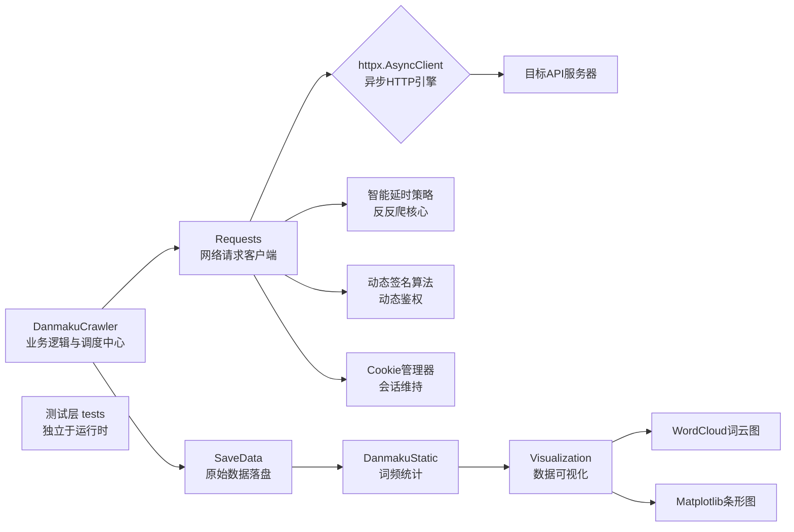

# Media Crawler Analysis
> **免责声明**：
> 
> 本项目仅供技术学习与交流。
> 
> 本项目仅为技术案例研究，所有代码均已做脱敏处理。任何人或组织不得将本仓库的内容用于非法抓取数据、侵犯他人合法权益或违反目标网站的用户协议。本仓库不提供任何可直接用于实际网站抓取的具体配置。对于因使用本仓库内容而引起的任何法律责任，本仓库及开发者不承担任何责任。使用本仓库的内容即表示您同意本免责声明的所有条款和条件。
>
> 点击查看更为详细的免责声明。[点击跳转](https://github.com/Drift-bottle/media-crawler-analysis#disclaimer)
> 
## 📖 项目简介
> 🎯 本项目是一个针对高强度反爬平台的数据采集系统工程实践案例。项目将动态签名算法、二进制协议解析器等已有组件，通过统一的异步架构和依赖注入进行系统集成，并自研了一套风控应对策略，最终构建了从数据获取、清洗、统计到可视化的完整流水线。
> - 本项目的开发环境为 Python 3.12，建议使用 3.11+ 版本。

## 一、 系统架构设计
本系统采用分层异步架构，核心分为三层：请求客户端层、业务逻辑层和数据处理层。

- **请求客户端层 (Requests 类)**：封装了 httpx.AsyncClient，集成了 Cookie 管理、动态鉴权（集成现有算法方案）、网络耗时监控、多层重试策略等核心网络交互功能。
- **业务逻辑层 (DanmakuCrawler 类)**：负责弹幕抓取的核心流程，包括参数构造、按内容层级逐片遍历并请求、调用客户端层发送请求，以及实现智能延时策略。
- **数据处理层 (SaveData & DanmakuStatic & Visualization 类)**：负责对原始数据进行保存并进行词频统计、词云图与条形图的生成。
> SaveData 类负责将抓取到的原始弹幕数据以JSON格式保存至本地文件系统。它充当了数据获取与数据分析之间的桥梁，实现了两者的解耦。

### 核心设计模式：依赖注入

本系统广泛采用依赖注入模式，以提高模块的灵活性和可测试性，这使得：
1. cookies的生命周期管理更灵活，可以在运行时动态刷新，而无需修改客户端内部代码。
2. 日志记录器可以方便地替换为不同的实现，满足不同场景的调试或生产需求。

## 二、 核心模块详解
### 1. 智能延时策略 (time_delay 方法)
**设计目标**：模拟人类观看视频时的间歇性行为，减小因过于规律的请求而被风控系统识别的可能性。

>说明：下文"策略逻辑"中的英文标注（如 num、NUM、a、b、c、d、e、f、Max_s、Min_s）均指向代码中直接硬编码的数字，仅用于此处策略叙述，并非可配置参数。

**延时策略的设计骨架（双路径决策 + 环境感知）**：
- **以内容密度分流——低密度用动态概率，高密度用预定触发点。响应耗时由 Requests 类的 event_hooks 记录，DanmakuCrawler 在采集流程中读取并传入 time_delay，与时段判断融合为统一的延时决策**

**策略逻辑**：
- **分段触发**：仅当分P分段数较多（≥num）时启用。根据当前最大分段数预先随机选几个分段索引作为“触发分段”，到达时执a - b秒长延时，模拟“停下来思考”或“被其他事情打断”的场景。
- **动态概率**：针对分段数较少（<num）的视频。内部维护计数器，每经历一次常规等待后+1。计数器越大，下次触发长延时的概率越高（公式 1/(NUM-计数器)，满NUM强制触发并重置），使长延时集中倾向中后段，接近人类注意力衰减的自然节奏。
- **自适应调整**：（用于根据网络状态与时段动态修正等待行为，减小被识别为规律性请求模式的可能性。）
  - 以网络响应耗时为反馈信号。耗时超 Max_s 秒时触发a - b秒长延时，作为风控退避——在分支一中其优先级低于计数器与动态概率，在分支二中低于分段触发点。
  - 耗时低于 Min_s 秒且非夜间高峰期时，将基础等待时间缩短至c - d秒。 
  - 夜间高峰期统一使用基础延时（e - f秒）：优先级低于网络响应耗时，分支一中同时计数以加速长延时的到来，分支二中仅维持基础等待。

### 2. 多层重试与风控应对 (_update_keys & inter_face_danmaku 方法)
**设计目标**：区分不同类型的请求失败（如签名过期、网络波动、触发性风控），并采取不同的应对策略，提高系统的鲁棒性。

**多层重试的设计骨架（异常分类 + 分层退避，平台相关细节已抽象）**：
- **自定义异常将失败分为“可恢复错误（签名过期、网络超时等）”与“风控触发”两类。基于 tenacity 构建双层装饰器——风控重试优先捕获，走长冷却（初始等待更长）；未被匹配的可恢复错误落入第二层，走短退避（有最大等待上限）。Requests 传输层封装签名刷新与状态码分发，Danmaku 继承后扩展弹幕请求专用的风控检测与重试触发。**

>说明：下文'分层重试机制'中的 Max_short、Max_long、COOKIE_EXPIRED_CODE均为硬编码，并非可配置参数

**分层重试机制 (基于 tenacity 库)**：
- **第一层**：处理网络超时、签名过期和 Cookie 失效等异常，采用较短的指数退避等待（最高 Max_short 秒）。
  - **自动恢复机制**：当检测到签名或 Cookie 失效时（如业务码 COOKIE_EXPIRED_CODE），系统会自动重新获取最新的签名或 Cookie，无需人工干预。
- **第二层**：专门处理因状态码触发的风控，采用更长的等待策略（最小 Max_long 秒）。

## 三、 完整的数据处理流水线
本项目构建了从二进制数据到可视化图表的全流程。

**1. 数据解析**：接收服务器返回的二进制数据，使用预编译的解析器反序列化，提取列表中的字段，返回弹幕文本列表。解析失败时记录错误日志并返回空列表。

**2. 数据保存**：将解析后的弹幕数据列表转换为字典格式（若元素包含 to_dict 方法则调用），以 JSON 格式写入文件。写入后调用 json_data_is_not_empty 校验文件内容有效性，校验失败时记录错误并抛出异常。

**3. 数据清洗**：对弹幕文本进行深度清洗，包括：
- **过滤**：去除停用词、纯数字/日期文本、长度不足的词。
- **去噪**：移除连续重复字符、标点符号、Emoji 表情。
**词频统计**：使用 collections.Counter 对清洗后的文本进行词频统计，并按降序排列。

**4. 数据可视化**：
- **词云图**：使用 wordcloud 库生成词云图，直观展示高频词汇。
- **水平条形图**：使用 matplotlib 库生成 TOP 20 高频词汇的条形图。
- **组合展示**：将词云图与条形图组合在一张16:9的画布上，适合放入PPT进行展示，并自动保存为高清PNG文件。
>数据处理管道的示例（清洗-统计-可视化，详见 [data/pipeline.py](https://github.com/Drift-bottle/media-crawler-analysis/data/pipeline.py)）：

## 四、 技术难点与解决方案
| 难点 | 描述                                 | 解决方案                                                                   |
|:---|:-----------------------------------|:-----------------------------------------------------------------------|
| 动态签名算法 | 请求参数需携带动态生成的加密签名，算法和密钥每日更新。        | 通过技术社区和 AI 辅助获取签名逻辑。将签名逻辑封装为 `client.py` 的内聚函数，实现自动刷新和缓存逻辑，对业务层透明。     |
| 二进制协议 | 弹幕数据使用特定的二进制格式，无法直接阅读和解析。          | 通过技术社区和 AI 辅助，快速获取了该协议的数据结构描述和预编译的 Python 解析器，并将其集成到系统中。               |
| 复杂的风控 | 平台拥有多层风控体系，包括签名校验、频率限制、行为分析。   | 设计分层的重试策略、智能的随机延时策略。                                                   |
| 数据完整性 | 在风控压力下，如何保证获取到的是完整数据而非被“静默过滤”后的数据。 | 通过参考目标视频的热度以及最后一个分段的时间长度，预先判断弹幕密度。若解析后列表为空，结合对该分段的预期，判断为“该分段可能无弹幕”并跳过。 |

## 五、 当前局限性
### 1. 使用真实 IP 直连
当前采用本地网络直连目标 API，未集成代理池。适合低频、低并发场景，暂未适配高并发分布式部署

### 2. 人机验证处理有限
当前代码**未集成自动打码方案或验证码识别模型**，若触发风控并下发特定字段，会抛出异常并进入重试流程。若重试耗尽仍失败，爬虫将**直接结束整个爬取流程**，不再请求后续分段，随后进入数据保存与可视化阶段。

### 3. 未使用代理池与指纹伪造
请求依赖 `httpx` 默认指纹，易被服务端识别。同时未使用代理池，当触发 IP 级风控时无法自动切换出口 IP。若需进一步降低被识别风险，可考虑集成 `curl_cffi` 和住宅代理池

### 4. 数据完整性校验依赖经验阈值
当前通过参考目标视频的热度以及最后一个分段的时间长度，预判分段弹幕密度来辅助校验。当弹幕列表为空时，会根据对该分段的预期，判断为“该分段可能无弹幕”并跳过，而非基于实际数据情况的严格校验

### 5. 测试覆盖范围有限
当前测试主要运行于 Windows 环境，尚未在 macOS / Linux 下进行充分验证。单元测试覆盖了日志装饰器和 Playwright 环境连通性，但暂未覆盖重试逻辑、签名刷新、错误处理等核心模块

## 六、 项目总结与反思

本项目是从零开始构建的一个完整数据采集与分析系统。通过实践，完成了以下工作：

- **系统集成**：将动态签名算法、二进制协议解析器、异步 HTTP 客户端、数据清洗与可视化等多个独立组件，通过统一异步架构与依赖注入进行系统化整合，形成了完整的端到端数据处理流水线。
- **策略设计**：针对目标平台的多层风控体系（签名校验、频率限制、行为分析），设计并实现了分层重试策略（基于 `tenacity`）与智能延时策略，作为应对风控的主要手段。
- **全链路工程**：项目由我主导设计，在 AI 辅助下完成核心组件开发与集成。独立完成了风控策略方案设计、代码整合、系统调试，以及从数据获取、清洗、统计到可视化的完整链路搭建。

## 附录

- **代码仓库**：私有仓库，具体实现细节不公开
- **许可证**：

  © 2026 Drift-bottle. 本仓库内的所有内容，包括但不限于分析文档、代码示例及相关图片，均作为统一的“作品”整体采用 [CC BY-ND 4.0](https://creativecommons.org/licenses/by-nd/4.0/) 许可协议。

  您可以自由地在任何媒介以任何形式复制和分享本作品，包括用于商业目的。但必须遵循以下条件：

  *    **署名** — 您必须给出**适当的署名**。署名应至少包括本作品名称（media-crawler-analysis）、作者（Drift-bottle）和来源(https://github.com/Drift-bottle/media-crawler-analysis) 。您不得以任何方式暗示许可人为您或您的使用背书。
  *    **禁止演绎** — 您不得修改、转换或者基于本作品进行再创作，并且不得分发修改后的版本。

  完整的许可协议文本请参阅 [LICENSE](LICENSE) 文件。

- **主要参考文档**：httpx 官方文档、Playwright API、Tenacity 重试库文档

> **说明**：本文档为系统设计分析，不包含可复用的具体代码或目标网站信息，仅供技术交流与求职展示使用