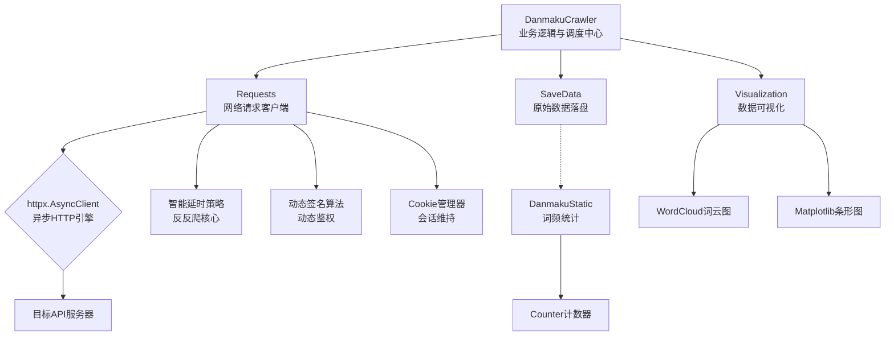

# Media Crawler Analysis
> **免责声明**：
> 
> 本项目仅供技术学习与交流。
> 
> 本项目仅为技术案例研究，所有代码均已做脱敏处理。任何人或组织不得将本仓库的内容用于非法抓取数据、侵犯他人合法权益或违反目标网站的用户协议。本仓库不提供任何可直接用于实际网站抓取的具体配置。对于因使用本仓库内容而引起的任何法律责任，本仓库及开发者不承担任何责任。使用本仓库的内容即表示您同意本免责声明的所有条款和条件。
>
> 点击查看更为详细的免责声明。[点击跳转](https://github.com/Drift-bottle/media-crawler-analysis#disclaimer)
> 
## 📖 项目简介
> 🎯 本项目是一个针对高强度反爬平台的数据采集系统工程实践案例。项目将动态签名算法、二进制协议解析器等已有组件，通过统一的异步架构和依赖注入进行系统集成，并自研了一套多层风控应对策略，最终构建了从数据获取、清洗、统计到可视化的完整流水线。
> - 本项目的开发环境为 Python 3.12，建议使用 3.11+ 版本。

## 🏗️ 一、 系统架构设计
本系统采用分层异步架构，核心分为三层： 请求客户端层、业务逻辑层和数据处理层。



- **请求客户端层 (Requests 类)**：封装了 httpx.AsyncClient，集成了 Cookie 管理、动态鉴权（集成现有算法方案）、网络耗时监控、多层重试策略以及风控验证码自动处理等核心网络交互功能。
- **业务逻辑层 (DanmakuCrawler 类)**：负责弹幕抓取的核心流程，包括参数构造、按内容层级逐片遍历并请求、调用客户端层发送请求，以及实现智能延时策略。
- **数据处理层 (SaveData & DanmakuStatic & Visualization 类)**：负责对原始数据进行保存并进行词频统计、词云图与条形图的生成。
> SaveData 类负责将抓取到的原始弹幕数据以JSON格式保存至本地文件系统。它充当了数据获取与数据分析之间的桥梁，实现了两者的解耦。

### 核心设计模式：依赖注入

本系统广泛采用依赖注入模式，以提高模块的灵活性和可测试性。
例如，Requests 类通过构造函数接收 cookies 和 logger：
```python
# Requests 类通过构造函数接收 cookies 和 logger 等依赖
# 这些依赖可以被灵活替换，无需修改类内部代码
class Requests:
    def __init__(self, cookies=None, logger=None):
        self.client = httpx.AsyncClient(
            cookies=cookies,
        )
        self.logger = logger or logging.getLogger(__name__)
        # 其他初始化逻辑...

    async def __aenter__(self):
        return self

    async def __aexit__(self, exc_type, exc_val, exc_tb):
        await self.client.aclose()
```
```python
# Danmaku 继承 Requests，复用其依赖注入和会话管理能力
# 同时扩展弹幕接口专用的重试和风控处理逻辑
class Danmaku(Requests):
    def __init__(self, cookies=None, logger=None):
        super().__init__(cookies=cookies, logger=logger)
        # Danmaku 特有的初始化逻辑...
        
# 在业务层，DanmakuCrawler 同样通过构造函数接收依赖
# 并在调用 Danmaku 时，将自身持有的依赖注入给客户端
class DanmakuCrawler:
    def __init__(self, cookies=None, logger=None):
        self.cookies = cookies
        self.logger = logger or logging.getLogger(__name__)
        # 其他初始化逻辑...

    async def fetch_danmaku(self, url, seg_url, video_url, api_key, video_type, params, **kwargs):
        # 将依赖注入给 Danmaku，实现职责分离
        async with Danmaku(cookies=self.cookies, logger=self.logger) as resp_obj:
            # 使用 resp_obj 进行网络请求...
            pass
```
```python
# 依赖的创建和传递在 main 函数中统一管理
async def main():
    # 创建 logger
    logger = logging_configuration('创建的 Logger 名称', '日志文件的名称')

    # 获取 cookies
    target_domains = ['...']
    cookies = await get_position_with_edge_login(target_domains, cookies_logger=logger)

    # 将依赖注入给 DanmakuCrawler
    crawler_obj = DanmakuCrawler(cookies=cookies, logger=logger)
    await crawler_obj.fetch_danmaku(url, seg_url, viedo_url, api_key, video_type, params, headers=headers, logger=logger)
```
这使得：
1. cookies的生命周期管理更灵活，可以在运行时动态刷新，而无需修改客户端内部代码。
2. 日志记录器可以方便地替换为不同的实现，满足不同场景的调试或生产需求。


## ⚙️ 二、 核心模块详解
### 1. 智能延时策略 (time_delay 方法)
**设计目标**：模拟人类观看视频时的间歇性行为，减小因过于规律的请求而被风控系统识别的可能性。

**策略逻辑**：
>说明：下文"策略逻辑"中的英文标注（如 num、a、b、c、d、e、f、min_seg、max_seg、Max_s、Min_s）均指向代码中直接硬编码的数字，仅用于此处策略叙述，并非可配置参数。代码中实际使用的分P标识（p、max_p 等）不在此列。
- **分段触发**：仅当分P分段数较多（≥num）时启用。为每个分P预先随机选定min_seg - max_seg个“触发分段”，到达时执a - b秒长延时，模拟“停下来思考”或“被其他事情打断”的场景。 。
- **动态概率**：针对分段数较少（<num）的视频。内部维护计数器，每经历一次常规等待后+1。计数器越大，下次触发长延时的概率越高（公式 1/(NUM-计数器)，满NUM强制触发并重置），使长延时集中倾向中后段，接近人类注意力衰减的自然节奏。
- **自适应调整**：（用于根据网络状态与时段动态修正等待行为，避免产生规律性请求模式。）
- 以网络响应耗时为反馈信号。耗时超 Max_s 秒时触发a - b秒长延时，作为风控退避——在分支一中其优先级低于计数器与动态概率，在分支二中低于分段触发点。
- 耗时低于 Min_s 秒且非夜间高峰期时，将基础等待时间缩短至c - d秒。 
- 夜间高峰期统一使用基础延时（e - f秒）：分支一中同时计数以加速长延时的到来，分支二中仅维持基础等待。

**延时策略的设计骨架（双路径决策 + 环境感知，完整阈值已抽象）**：
- **以内容密度分流——低密度用动态概率，高密度用预定触发点。响应耗时由 Requests 类的 event_hooks 记录，DanmakuCrawler 在采集流程中读取并传入 time_delay，与时段判断融合为统一的延时决策**
```python
class Requests:
    def __init__(self, cookies=None, logger=None):
        # 设置请求前钩子, 统一会话
        self.client = httpx.AsyncClient(
            cookies=cookies,
            event_hooks={
                'request': [self._hook_start_time],
                'response': [self._hook_end_time]
            },
            timeout=10
        )
        # 设置 logger
        self.logger = logger or logging.getLogger(__name__)
        # 设置网络请求耗时
        self._last_response_time: float = 0
        # 其他初始化逻辑...

    # 请求钩子
    async def _hook_start_time(self, request: httpx.Request) -> None:
        request.headers['x-by-start'] = str(time.perf_counter())

    # 响应钩子
    async def _hook_end_time(self, response: httpx.Response) -> None:
        start = float(response.request.headers.get('x-by-start', 0))
        self._last_response_time = time.perf_counter() - start
        self.logger.debug(f"{response.request.url}耗时: {self._last_response_time:.6f}秒")

    def get_last_response(self):
        """暴露给 crawler 使用的接口, 获取最近一次请求的耗时"""
        return self._last_response_time
```
```python
class Danmaku(Requests):
    def __init__(self, cookies=None, logger=None):
        super().__init__(cookies=cookies, logger=logger)
        # Danmaku 特有的初始化逻辑...
        
class DanmakuCrawler:
    """弹幕抓取与解析的核心业务类，负责控制请求节奏和组装数据"""
    def __init__(self, cookies: Cookies = None, logger=None):
        self._long_delay_counter: int = 0  # 长等待计数器
        # 其他初始化逻辑...
    
    async def time_delay_with_night(self):
        """根据当前时间智能延时"""
        # 时段判断作为一个独立的布尔反馈源, 具体时区与时段范围不在此展开
        pass

    async def time_delay(self, p, max_p, title, seg_idx, max_seg_idx, response_time) -> None:
        """根据请求上下文（采集进度、分段密度、网络响应）智能计算等待时长，模拟人类间歇性观看行为。"""
        # 延时处理...
        pass
        
    # 以下为 fetch_danmaku 的核心流程示例，省略了具体的日志记录,数据处理与异常分支
    @logger
    async def fetch_danmaku(self, url, seg_url, video_url, api_key, video_type, params, **kwargs):
        """
        完整弹幕抓取流程: 获取视频信息 -> 按内容层级逐片遍历请求弹幕 -> 解析并存储
        Args:
            url: 用于获取视频关键信息的 url
            seg_url: 用于获取视频弹幕的 url
            video_url: 需要处理验证码的 url
            api_key: CapSolver 所需的 clientKey
            video_type: 视频类型
            params: 查询参数(供 请求弹幕数据的函数 用)
            kwargs: headers请求头, logger(供 @logger 使用)
        """
        # 将依赖注入给 Danmaku，实现职责分离
        async with Danmaku(cookies=self.cookies, logger=self.logger) as resp_obj:
            # 使用 resp_obj 进行网络请求...
            # 获取必要参数并进行是否成功获取的判断...
                # for循环遍历...
                    # 中间业务逻辑...
                    # 预先随机选 min_seg - max_seg 个分段索引作为"触发点"
                    if not hasattr(self, '_trigger_seg'):
                        self._trigger_seg = []
                        random_num = random.randint(min_seg, max_seg)
                        trigger = [random.randint(1, max_seg_idx) for i in range(random_num)]
                        self._trigger_seg.extend(trigger)
                    # for循环遍历...
                        # 中间业务逻辑...
                        # 请求弹幕数据
                        resp_danmaku = await ...
                    
                        # 获取该次请求的耗时
                        response_time = resp_obj.get_last_response()
                
                        if resp_danmaku:
                            # 获取数据与数据处理操作...
                            if len_danmaku == 0:
                                # 延时操作
                                await self.time_delay(p, max_p, title, seg_idx, max_seg_idx, response_time)
                                continue
                            else:
                                self.logger.info(f"✅成功获取弹幕数据 | 获取的弹幕个数: {len_danmaku}")
                        else:
                            # 异常处理逻辑...
                            pass
                        # 数据处理逻辑...
                        # 延时操作
                        await self.time_delay(p, max_p, title, seg_idx, max_seg_idx, response_time)
                
                    # 数据处理逻辑...
                    # 当前分 P 结束后, 清除"触发点", 下一分 P 会重新随机生成
                    delattr(self, '_trigger_seg')
                    pass
```

### 2. 多层重试与风控应对 (_update_keys & inter_face_danmaku 方法)
**设计目标**：区分不同类型的请求失败（如签名过期、网络波动、触发性风控），并采取不同的应对策略，提高系统的鲁棒性。

**分层重试机制 (基于 tenacity 库)**：
>说明：下文'分层重试机制'以及示例代码中的 Max_short, Max_long以及和COOKIE_EXPIRED_CODE同样用大写字母和'_'创建的名称均为硬编码数字，并非可配置参数
- **第一层**：处理网络超时和签名过期等常见错误，采用较短的指数退避等待（最高 Max_short 秒）。
- **第二层**：专门处理因状态码触发的风控，采用更长的等待策略（最小 Max_long 秒），给服务器更长的“冷静期”。
- **风控信号识别**：在解析响应时，会主动检查 HTTP 响应头中是否存在风控标志。一旦发现，系统会暂停当前任务并触发相应的重试逻辑。
- **自动恢复机制**：当检测到 Cookie 失效时（如业务码 COOKIE_EXPIRED_CODE），系统会自动重新获取最新的 Cookie 并更新客户端会话，无需人工干预。

**多层重试的设计骨架（异常分类 + 分层退避，平台相关细节已抽象）**：
- **自定义异常将失败分为“可恢复错误（签名过期、网络超时等）”与“风控触发”两类。基于 tenacity 构建双层装饰器——风控重试优先捕获，走长冷却（初始等待更长）；未被匹配的可恢复错误落入第二层，走短退避（有最大等待上限）。Requests 传输层封装签名刷新与状态码分发，Danmaku 继承后扩展弹幕请求专用的风控检测与重试触发。**
```python
# ------设置自定义异常------
class SignatureExpired(Exception):
    """动态加密签名可能过期，需要刷新密钥"""
    pass

class SignatureStatusCode(Exception):
    """返回的状态码是 特殊风控状态码, 需要进行特殊延时处理, 刷新密钥"""
    pass
```
```python
class Requests:
    # 显式声明为异步方法
    _update_keys: Callable[..., Coroutine[Any, Any, None]]

    def __init__(self, cookies=None, logger=None):
        self.client = httpx.AsyncClient(
            cookies=cookies,
        )
        # 设置logger
        self.logger = logger or logging.getLogger(__name__)
        
        # 创建带重试逻辑的 inter_face_sign 方法
        self._create_retry_methods_update_keys()
        
        # 上一次更新 mixin_key 的时间
        self._last_update: float = 0

        # 用于获取生成动态加密签名的最初参数的 url
        self.secret_url = '...'
        # 暂存当前请求的 params
        self._current_params: dict[str, object] = {}
        # 暂存用于获取密钥的接口的 headers
        self._secret_headers: dict[str, object] = {}

        # 设置 target_domains
        self.target_domains = ['...']
        # 其他初始化逻辑...

    def _log_sleep_and_update(self, retry_state):
        """记录本次等待时间"""
        wait_seconds = retry_state.next_action.sleep
        self.logger.info(f"加密动态签名可能过期, 等待 {wait_seconds:.2f} 秒后重试...")

    def _debug_hex(self, content) -> str:
        """将二进制内容格式化为可读的十六进制字符串"""
        hex_str = content.hex()
        # 把每两个十六进制字符后面加一个空格，方便阅读
        return ' '.join(hex_str[i:i + 2] for i in range(0, min(200, len(hex_str)), 2))

    def parse_retry_after(self, response) -> int:
        """
        从响应头解析服务端建议的重试等待时间, 适用于 RATE_LIMIT_CODE 等风控状态码
        :param response: httpx.Response 对象
        :return: 建议等待的最小秒数
        """
        # 如果解析失败或响应头缺失, 则使用此默认值
        acq_delay_time = BASE_WAIT

        retry_after = response.headers.get('...')
        if not retry_after:
            return acq_delay_time
        try:
            # 优先尝试解析为纯秒数, 如 "60"
            return int(retry_after)
        except ValueError:
            pass
        try:
            # 再尝试解析为HTTP日期格式, 如 "Wed, 21 Oct 2025 07:28:00 GMT"
            retry_time = parsedate_to_datetime(retry_after)
            now = datetime.now(tz=retry_time.tzinfo)
            wait = (retry_time - now).total_seconds()
            return max(0, int(wait))  # 确保不返回负数
        except Exception:
            return acq_delay_time

    async def status_code_err(self, response) -> None:
        """
        根据返回的状态码进行特定的异常处理
        :param response: httpx.Response 对象
        """
        # 获取响应内容前 100 字节
        content = response.content[:100]
        # 获取格式化 16 进制响应内容
        formatted_hex = self._debug_hex(content)

        # 设置状态码异常
        err = f"❌请求失败 | 状态码: {response.status_code} | 响应内容前100字节(16进制): {formatted_hex}"

        if response.status_code == RATE_LIMIT_CODE:
            self.logger.error(err)
            # 初步延时处理
            delay_time = self.parse_retry_after(response)
            self.logger.warning(f"先等待 {delay_time:.2f} 秒")
            await asyncio.sleep(delay_time)
            raise SignatureExpired(err)
        elif response.status_code == RISK_CODE:
            self.logger.error(err)
            raise SignatureStatusCode(err)
        elif response.status_code == FORBIDDEN_CODE:
            self.logger.error(err)
            raise Exception(err)
        else:
            raise SignatureExpired(err)

    def _create_retry_methods_update_keys(self):
        """创建带分层重试逻辑的 _update_keys 方法"""
        # 定义重试装饰器
        # _update_keys 用的是和 inter_face_danmaku(Danmaku类中) 相似的重试装饰器
        # 唯一区别: _update_keys 用的重试装饰器未设置 after

        @retry_decorator_status_code
        @retry_decorator # 处理的是没有被外层层捕获的异常
        @logger
        async def _update_keys(self, **kwargs) -> None:
            """
            从接口获取并缓存 密钥(每天自动刷新)
            :param kwargs: logger(供 @logger 使用)
            """
            now = time.time()
            # 缓存一天(86400 秒)，避免频繁请求
            if self._mixin_key and (now - self._last_update) < 86400:
                return

            # 发送请求
            resp = await self.client.get(self.secret_url, headers=self._secret_headers)

            try:
                data = resp.json()
                if resp.status_code == 200:
                    # 判断网站 API 返回的业务状态码
                    if data['code'] != 0:
                        error_msg = data['message'] or data['msg'] or '未知错误'
                        err = f"❌获取失败 | {data['data']}: {error_msg}"
                        self.logger.error(err)
                        if data['code'] == COOKIE_EXPIRED_CODE:
                            # 获取当前 cookies
                            old_cookies = self.client.cookies.copy()
                            # 获取新 cookies
                            cookies = await get_position_with_edge_login(self.target_domains, cookies_logger=self.logger)
                            if cookies and cookies != old_cookies:
                                # 更新 cookies
                                self.client.cookies = cookies
                                self.logger.warning("业务码: COOKIE_EXPIRED_CODE | 已重新获取 cookies")
                        raise SignatureExpired(err)
                    else:
                        # 密钥生成逻辑...
                        pass
                else:
                    await self.status_code_err(resp)
            except Exception as e:
                # 异常处理...
                pass

        # 绑定到 Danmaku 类的实例, Python 自动传入 self
        self._update_keys = _update_keys.__get__(self)

    async def sign(self) -> dict[str, object]:
        """处理参数字典，生成包含 动态签名 的新字典"""
        # 获取 mixin_key
        await self._update_keys(logger=self.logger)
        # 签名处理逻辑...
        return self._current_params
```
```python
# Danmaku 继承 Requests，复用其依赖注入和会话管理能力
# 同时扩展弹幕接口专用的重试和风控处理逻辑
class Danmaku(Requests):
    # 显式声明为异步方法
    inter_face: Callable[..., Coroutine[Any, Any, tuple]]

    def __init__(self, cookies=None, logger=None):
        super().__init__(cookies=cookies, logger=logger)
        # 创建带重试逻辑的 inter_face_danmaku 方法
        self._create_retry_methods_danmaku()

    async def _after_retry_sign(self, retry_state):
        """
        重试后刷新签名的异步回调
        tenacity 要求 after 回调返回 None，此处不返回 sign() 的返回值以满足类型检查
        """
        await self.sign()
        return None

    def _create_retry_methods_danmaku(self):
        """创建带分层重试逻辑的 inter_face_danmaku 方法"""

        # 定义重试装饰器
        # 注意: initial, Min_short, Max_short, num, a, b均为硬编码数字，并非可配置参数(a, b的差值相对较大)
        retry_decorator_status_code = retry(
            stop=stop_after_attempt(num),
            wait=wait_exponential_jitter(initial=Max_short) + wait_random(a, b),
            retry=retry_if_exception_type(SignatureStatusCode),
            before_sleep=self._log_sleep_and_update,
            after=self._after_retry_sign,
            reraise=True,
        )
        retry_decorator = retry(
            stop=stop_after_attempt(num),
            wait=wait_exponential_jitter(initial=initial, max=Min_short) + wait_random(a, b),
            retry=retry_if_exception_type((SignatureExpired, TimeoutError, ConnectionError)),
            before_sleep=self._log_sleep_and_update,
            after=self._after_retry_sign,
            reraise=True,
        )

        @retry_decorator_status_code
        @retry_decorator # 处理的是没有被外层层捕获的异常
        @logger
        async def inter_face_danmaku(self, url, video_url, api_key, **kwargs):
            """
            请求弹幕接口, 重试时会通过 after 回调自动刷新 动态加密签名
            Args:
                url: 用于发送请求的 url
                video_url: 需要处理验证码的 url
                api_key: CapSolver 所需的 clientKey
                kwargs: headers请求头, logger(供 @logger 使用)
            Returns: 
                返回  httpx.Response 对象
            """
            if '...' in url:
                resp = await self.client.get(url, params=self._current_params, **kwargs)

                try:
                    # 检测status_code
                    if resp.status_code == 200:
                        # 检查风控响应头, 若存在 risk_content 则表示触发风控验证
                        risk_content = resp.headers.get('...')
                        if risk_content:
                            err = f"❌触发风控验证, risk_content: {risk_content}"
                            self.logger.warning(err)
                            # 处理验证码...(具体流程见 验证码自动处理 模块)
                            raise SignatureExpired(err)
                        return resp
                    else:
                        await self.status_code_err(resp)
                except Exception as e:
                    # 异常处理...
                    pass
            else:
                return None

        # 绑定到 Danmaku 类的实例, Python 自动传入 self
        self.inter_face_danmaku = inter_face_danmaku.__get__(self)

       
class DanmakuCrawler:
    """弹幕抓取与解析的核心业务类，负责控制请求节奏和组装数据"""
    def __init__(self, cookies=None, logger=None):
        self.cookies = cookies
        self.logger = logger or logging.getLogger(__name__)
        # 其他初始化逻辑...

    async def fetch_danmaku(self, url, seg_url, video_url, api_key, video_type, params, **kwargs):
        """
        完整弹幕抓取流程: 获取视频信息 -> 按内容层级逐片遍历请求弹幕 -> 解析并存储
        详细参数说明见 智能延时策略 文档。
        """
        # 将依赖注入给 Danmaku，实现职责分离
        async with Danmaku(cookies=self.cookies, logger=self.logger) as resp_obj:
            # 使用 resp_obj 进行网络请求...
            # 获取必要参数并进行是否成功获取的判断...
                # for循环遍历...
                    # 中间业务逻辑...
                
                    # for循环遍历...
                        current_params = ...
                        # 中间业务逻辑...
                        # 请求弹幕数据
                        # 获取副本, 减小原始 current_params 被修改的可能性
                        resp_obj._current_params = current_params.copy()
                        # 判断是否成功获取签名的 params...
                        resp_danmaku = await resp_obj.inter_face_danmaku(seg_url, video_url, api_key, **kwargs, logger=self.logger)
                        # 中间业务逻辑...
                        pass
```
### 3. 验证码自动处理 (handle_captcha 方法)
**设计目标**：在触发风控验证码时，自动完成验证码的注册、求解和提交，实现无需人工介入下的自动恢复。

**工作流程**：
- **检测**：在 API 响应头中监测到风控令牌。
- **注册**：立即带上该令牌，向风控网关接口发起请求，注册一个验证码任务，获取 captchaId 等参数。
- **求解**：将获取的参数提交给第三方验证码识别服务（如 CapSolver）。
- **恢复**：识别成功后，使原请求有机会重新执行。

**验证码自动处理的设计骨架（检测-注册-求解-恢复，平台相关细节已抽象）**：
- **在 Danmaku 请求弹幕时主动检测风控响应头，捕获到风控令牌后交由 Requests 传输层的 handle_captcha 处理——向风控网关注册任务获取 captchaId，再提交第三方服务求解。注册与求解阶段各自带有独立的重试机制，针对的是验证码处理流程本身的失败。求解成功后，由调用方主动发出重试信号，触发分层重试重新发起被拦截的弹幕请求；若验证码处理最终失败，异常向上传播，弹幕请求不再重试。**
```python
# ------处理验证码------
@retry(
    stop=stop_after_attempt(num),
    wait=wait_exponential(...),
    retry=retry_if_exception_type(Exception),
    reraise=True  # 达到最大重试次数后抛出原始异常
)
@logger
async def capsolver(api_key, captcha_id, url, **kwargs) -> None:
    """
    调用 CapSolver API处理验证码
    Args:
        api_key: clientKey
        captcha_id: captchaId
        url: 需要处理验证码的 url
        kwargs: logger(供 @logger 使用)
    """
    # 获取 logger
    logger = kwargs.pop('logger', logging.getLogger(__name__))

    payload = {
        "clientKey": api_key,
        "task": {
            "type": '...',
            "websiteURL": url,
            "captchaId": captcha_id,
        }
    }
    async with httpx.AsyncClient() as client:
        res = await client.post("...", json=payload)
        resp = res.json()
        task_id = resp.get("taskId")
        if not task_id:
            e = f"❌获取 taskId 失败: {res.text}"
            logger.error(e)
            raise Exception(e)
        logger.info(f"获取的 taskId: {task_id}")

        # 检查是否处理成功验证码
        while True:
            # 随机延时
            delay_time = random.uniform(3,10)
            await asyncio.sleep(delay_time)

            payload = {"clientKey": api_key, "taskId": task_id}
            res = await client.post("...", json=payload)
            resp = res.json()
            status = resp.get("status")
            if status == "ready":
                logger.info(f"处理验证码结果: {resp.get("solution")}")
                break
            elif status == "failed" or resp.get("errorId"):
                e = f"❌处理验证码失败 | response: {res.text}"
                logger.error(e)
                raise Exception(e)
```
```python
class Requests:
    def __init__(self, cookies=None, logger=None):
        self.client = httpx.AsyncClient(
            cookies=cookies,
        )
        # 设置logger
        self.logger = logger or logging.getLogger(__name__)
        
        # 用于获取 captchaId 的url
        self.risk_captcha_url = '...'
        # 其他初始化操作...
        
    def _debug_hex(self, content) -> str:
        """将二进制内容格式化为可读的十六进制字符串"""
        hex_str = content.hex()
        # 把每两个十六进制字符后面加一个空格，方便阅读
        return ' '.join(hex_str[i:i + 2] for i in range(0, min(200, len(hex_str)), 2))
        
    # initial_another, c, d均为硬编码的数字(c, d间隔较小)
    @retry(
        stop=stop_after_attempt(num),
        wait=wait_exponential_jitter(initial=initial_another) + wait_random(c, d), 
        retry=retry_if_exception_type(Exception),
        reraise=True
    )
    @logger
    async def handle_captcha(self, url, risk_content, api_key, **kwargs) -> None:
        """
        处理触发风控时返回的验证码
        Args:
            url: 需要处理验证码的 url
            risk_content: 风控响应头内容
            api_key: CapSolver 所需的 clientKey
            kwargs: logger(供 @logger 使用)
        """
        # 设置 params
        captcha_params = {
            '...': risk_content
        }
        # 发送请求
        resp_captcha = await self.client.post(self.risk_captcha_url, data=captcha_params)

        # 获取响应内容前 100 字节
        content = resp_captcha.content[:100]
        # 获取格式化 16 进制响应内容
        formatted_hex = self._debug_hex(content)

        try:
            data = resp_captcha.json()
            if resp_captcha.status_code == 200:
                # 判断网站 API 返回的业务状态码
                if data['code'] != 0:
                    error_msg = data['message'] or data['msg'] or '未知错误'
                    err = f"❌获取失败 | {data['data']}: {error_msg}"
                    self.logger.error(err)
                    raise Exception(err)
                else:
                    # 获取 captchaId(从data中获取)
                    captcha_id = 
                    if captcha_id:
                        # 调用 CapsSolver API 处理验证码
                        await capsolver(api_key, captcha_id, url, logger=self.logger)
                    else:
                        err = f"❌获取失败 | data['...']: {data['...']}"
                        self.logger.error(err)
                        raise Exception(err)
            else:
                err = f"❌请求失败 | 状态码；{resp_captcha.status_code} | 响应内容前100字节(16进制): {formatted_hex}"
                # 其他异常处理...
                pass
        except Exception as e:
            # 异常处理...
            pass
```
```python
# Danmaku 继承 Requests，复用其依赖注入和会话管理能力
# 同时扩展弹幕接口专用的重试和风控处理逻辑
class Danmaku(Requests):
    # 显式声明为异步方法
    inter_face: Callable[..., Coroutine[Any, Any, tuple]]

    def __init__(self, cookies=None, logger=None):
        super().__init__(cookies=cookies, logger=logger)
        # 创建带重试逻辑的 inter_face_danmaku 方法
        self._create_retry_methods_danmaku()

    def _create_retry_methods_danmaku(self):
        """创建带分层重试逻辑的 inter_face_danmaku 方法"""

        # 定义重试装饰器（见分层重试模块）
        
        @retry_decorator_status_code
        @retry_decorator # 处理的是没有被外层层捕获的异常
        @logger
        async def inter_face_danmaku(self, url, video_url, api_key, **kwargs):
            """
            请求弹幕接口, 重试时会通过 after 回调自动刷新 动态加密签名
            详细参数说明见 延时多层重试与风控应对 文档。
            """
            if '...' in url:
                resp = await self.client.get(url, params=self._current_params, **kwargs)

                try:
                    # 检测status_code
                    if resp.status_code == 200:
                        # 检查风控响应头, 若存在 risk_content 则表示触发风控验证
                        risk_content = resp.headers.get('...')
                        if risk_content:
                            err = f"❌触发风控验证, risk_content: {risk_content}"
                            self.logger.warning(err)
                            await self.handle_captcha(video_url, risk_content, api_key, logger=self.logger)
                            raise SignatureExpired(err) #（见分层重试模块）
                        return resp
                    else:
                        # 非 200 响应交由状态码分发逻辑处理（见分层重试模块）
                        await self.status_code_err(resp)
                except Exception as e:
                    # 异常处理...
                    pass
            else:
                return None

        # 绑定到 Danmaku 类的实例, Python 自动传入 self
        self.inter_face_danmaku = inter_face_danmaku.__get__(self)


class DanmakuCrawler:
    """弹幕抓取与解析的核心业务类，负责控制请求节奏和组装数据"""
    def __init__(self, cookies=None, logger=None):
        self.cookies = cookies
        self.logger = logger or logging.getLogger(__name__)
        # 其他初始化逻辑...

    async def fetch_danmaku(self, url, seg_url, video_url, api_key, video_type, params, **kwargs):
        """
        完整弹幕抓取流程: 获取视频信息 -> 按内容层级逐片遍历请求弹幕 -> 解析并存储
        详细参数说明见 智能延时策略 文档。
        """
        # 将依赖注入给 Danmaku，实现职责分离
        async with Danmaku(cookies=self.cookies, logger=self.logger) as resp_obj:
            # 使用 resp_obj 进行网络请求...
            # 获取必要参数并进行是否成功获取的判断...
                # for循环遍历...
                    # 中间业务逻辑...
                
                    # for循环遍历...
                        # 中间业务逻辑...
                        # 请求弹幕数据
                        resp_danmaku = await resp_obj.inter_face_danmaku(seg_url, video_url, api_key, **kwargs, logger=self.logger)
                        # 中间业务逻辑...
                        pass
```

## 🔄 三、 完整的数据处理流水线
本项目构建了从二进制数据到可视化图表的全流程。

**数据解析**：接收服务器返回的二进制数据，使用预编译的解析器将其反序列化为结构化的 Python 对象，并提取出弹幕文本信息。
```python
from dataclasses import dataclass, asdict
from collections import Counter

@dataclass
class DanmakuSingleP:
    """DanmakuCrawler类中使用, 用于储存每个分 P 所有分段的所有弹幕的列表"""
    title: str
    danmaku_p_list: list

    def to_dict(self):
        return asdict(self)
```
```python
class DanmakuCrawler:
    """弹幕抓取与解析的核心业务类，负责控制请求节奏和组装数据"""
    def __init__(self, cookies=None, logger=None):
        self._all_danmaku = []  # 储存所有分 P 弹幕的列表
        self.cookies = cookies
        self.logger = logger or logging.getLogger(__name__)
        # 其他初始化逻辑...

    def _parse_danmaku(self, response_content: bytes) -> list[str]:
        """
        安全地解析弹幕数据, 返回弹幕内容列表 | 解析失败或数据为空时返回空列表
        :param response_content: 弹幕二进制数据
        """
        # 解析二进制数据
        da = ...
        try:
            # 数据预处理...
            return [elem.content for elem in da.elems if elem.content]
        except Exception as e:
            self.logger.error(f"❌弹幕解析失败: {e}")
            return []
        
    async def fetch_danmaku(self, url, seg_url, video_url, api_key, video_type, params, **kwargs):
        """
        完整弹幕抓取流程: 获取视频信息 -> 按内容层级逐片遍历请求弹幕 -> 解析并存储
        详细参数说明见 智能延时策略 文档。
        """
        # 将依赖注入给 Danmaku，实现职责分离
        async with Danmaku(cookies=self.cookies, logger=self.logger) as resp_obj:
            # 使用 resp_obj 进行网络请求...
            # 获取必要参数并进行是否成功获取的判断...
                # for循环遍历...
                    title = ... # 必要参数之一
                    # 中间业务逻辑...
                    # 获取解析后的每个分 P 所有分段的弹幕数据列表
                    danmaku_p_list = []
                    # for循环遍历...
                        # 中间业务逻辑...
                        # 请求弹幕数据
                        resp_danmaku = await resp_obj.inter_face_danmaku(seg_url, video_url, api_key, **kwargs, logger=self.logger)
                        # 中间业务逻辑...
                        if resp_danmaku:
                            # 获取弹幕二进制数据
                            bytes_content = resp_danmaku.content
                            # 获取解析后的每个分 P 每个分段的弹幕数据列表
                            danmaku_seg_idx_list = self._parse_danmaku(bytes_content)
                            # 中间业务逻辑...
                        else:
                            # 异常处理...
                            pass
                        danmaku_p_list.extend(danmaku_seg_idx_list)
                    # 创建 DanmakuSingleCid 实例
                    danmaku_p_dict = DanmakuSingleP(title=title, danmaku_p_list=danmaku_p_list)
                    self._all_danmaku.append(danmaku_p_dict)
                    # 中间业务逻辑...
            return self._all_danmaku
```
**数据清洗**：对弹幕文本进行深度清洗，包括：
- **过滤**：去除停用词、纯数字/日期文本、长度不足的词。
- **去噪**：移除连续重复字符、标点符号、Emoji 表情。

**词频统计**：使用 collections.Counter 对清洗后的文本进行词频统计，并按降序排列。

**数据可视化**：
- **词云图**：使用 wordcloud 库生成词云图，直观展示高频词汇。
- **水平条形图**：使用 matplotlib 库生成 TOP 20 高频词汇的条形图。
- **组合展示**：将词云图与条形图组合在一张16:9的画布上，适合放入PPT进行展示，并自动保存为高清PNG文件。
>数据处理管道的骨架示例（清洗-统计-可视化，详见 [danmaku/data_pipeline.py](https://github.com/Drift-bottle/media-crawler-analysis/danmaku/data_pipeline.py)）：
> - 将解析后的弹幕文本经多级清洗流入词频统计，最终生成词云与条形图的组合图。DanmakuStatic 负责清洗与统计，Visualization 负责图表渲染，两者通过词频字典解耦。

## 🧩 四、 技术难点与解决方案
| 难点 | 描述                                 | 解决方案                                                       |
|:---|:-----------------------------------|:-----------------------------------------------------------|
| 动态签名算法 | 请求参数需携带动态生成的加密签名，密钥每日更新。           | 实现自动刷新和缓存逻辑，将签名逻辑封装为独立模块，对业务层透明。                           |
| 二进制协议 | 弹幕数据使用特定的二进制格式，无法直接阅读和解析。          | 通过技术社区和 AI 辅助，快速获取了该协议的数据结构描述和预编译的 Python 解析器，并将其集成到系统中。   |
| 复杂的风控 | 平台拥有多层风控体系，包括签名校验、频率限制、行为分析和验证码。   | 设计分层的重试策略、智能的随机延时策略，以及自动化的验证码处理流程。                         |
| 数据完整性 | 在风控压力下，如何保证获取到的是完整数据而非被“静默过滤”后的数据。 | 通过参考目标视频的社区热度，预先判断弹幕密度。若解析后列表为空，结合对该分段的预期，判断为“该分段可能无弹幕”并跳过。|


## 💎 五、 项目总结与反思
本项目是从零开始构建的一个复杂系统。通过它，我实践了：

- **系统集成**：如何将多个独立、复杂的组件有机整合。
- **策略设计**：如何针对真实世界的复杂问题（反爬），设计出一套行之有效的应对策略。
- **全链路工程**：本项目由我主导设计，并在AI工具的辅助下完成开发。通过与AI协作解决复杂的算法和架构问题，我独立完成了核心风控策略的设计、代码整合、系统调试以及从数据获取到可视化的全链路工程构建。
>在数据完整性校验上，当前策略依赖对目标视频的先验了解，存在一定的局限性。若面对完全陌生的视频，该策略可能无法准确区分“真实空数据”与“风控导致的空数据”。这是一个需要在未来继续优化的权衡点。


## 📄 许可证

© 2026 Drift-bottle. 本仓库内的所有内容，包括但不限于分析文档、代码示例及相关图片，均作为统一的“作品”整体采用 [CC BY-ND 4.0](https://creativecommons.org/licenses/by-nd/4.0/) 许可协议。

您可以自由地在任何媒介以任何形式复制和分享本作品，包括用于商业目的。但必须遵循以下条件：

*   **署名** — 您必须给出**适当的署名**。署名应至少包括本作品名称（media-crawler-analysis）、作者（Drift-bottle）和来源(https://github.com/Drift-bottle/media-crawler-analysis)。您不得以任何方式暗示许可人为您或您的使用背书。
*   **禁止演绎** — 您不得修改、转换或者基于本作品进行再创作，并且不得分发修改后的版本。

> **补充说明**：本项目中的代码示例是为辅助分析文档而提供的解释性材料。在适用法律允许的最大范围内，作者不希望代码示例被解释为独立的、可修改的软件作品。如有任何疑问，请联系作者获取进一步许可。

完整的许可协议文本请参阅 [LICENSE](LICENSE) 文件。

## <a id="disclaimer"></a> ⚠️ 免责声明
### 1. 项目目的与性质
本项目（以下简称“本项目”）是作为一个技术研究与学习工具而创建的，旨在探索和学习网络数据采集技术。本项目仅为技术案例研究，旨在提供给学习者和研究者作为技术交流之用。

### 2. 法律合规性声明
本项目开发者（以下简称“开发者”）郑重提醒用户在使用本项目时，严格遵守中华人民共和国相关法律法规，包括但不限于《中华人民共和国网络安全法》、《中华人民共和国反间谍法》等所有适用的国家法律和政策。用户应自行承担一切因使用本项目而可能引起的法律责任。

### 3. 使用目的限制
本项目严禁用于任何非法目的的行为。本项目不得用于任何形式的非法侵入他人计算机系统，不得用于任何侵犯他人知识产权或其他合法权益的行为。

### 4. 免责声明
开发者已尽最大努力确保本项目的正当性及安全性，但不对用户使用本项目可能引起的任何形式的直接或间接损失承担责任。包括但不限于由于使用本项目而导致的任何数据丢失、设备损坏、法律诉讼等。

### 5. 知识产权声明
本项目的知识产权归开发者所有。本项目受到著作权法和国际著作权条约以及其他知识产权法律和条约的保护。用户在遵守本声明及相关法律法规的前提下，可以下载和使用本项目。

### 6. 最终解释权
关于本项目的最终解释权归开发者所有。开发者保留随时更改或更新本免责声明的权利，恕不另行通知。

### 法律风险参考资料
- [中国爬虫违法违规案例汇总](https://github.com/HiddenStrawberry/Crawler_Illegal_Cases_In_China)